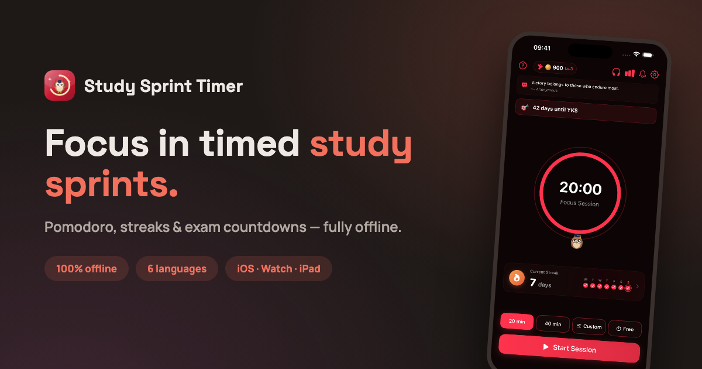

# studysprinttimer.com

Marketing and support site for **[Study Sprint Timer](https://apps.apple.com/app/id6788031531)** —
an offline-first Pomodoro study timer for iPhone, iPad and Apple Watch.



**Live:** [studysprinttimer.com](https://studysprinttimer.com)

## What's inside

- `index.html` — landing page: hero, feature bento grid, screen gallery, App Store reviews
- `support.html` — help center & FAQ
- `privacy.html` / `terms.html` — legal pages (content dictionaries in `legal.js`)
- `404.html`, `robots.txt`, `sitemap.xml`, `og.png` — SEO & error handling
- `shots/` — real app screenshots used across the site
- `app-ads.txt` — AdMob authorized sellers

## Features

- **Zero build step.** Hand-written static HTML/CSS/JS — no framework, no bundler.
- **6 languages** (EN, TR, DE, ES, FR, RU) via inline `data-i18n` dictionaries with a
  client-side switcher; the visitor's browser language is auto-detected.
- **Dark / light theme** with a toggle, persisted in `localStorage` (dark by default).
- **SEO ready:** per-page canonical + Open Graph/Twitter cards, JSON-LD
  `SoftwareApplication` schema, sitemap and an App Store Smart Banner.

## Development

No tooling required — open the files in a browser, or serve locally:

```bash
python3 -m http.server 8000
```

## Deployment

Hosted on **GitHub Pages** (branch `main`, root) behind **Cloudflare** (DNS + HTTPS).
Every push to `main` deploys automatically.

---

© 2026 Study Sprint Timer · Harun Doğdu
